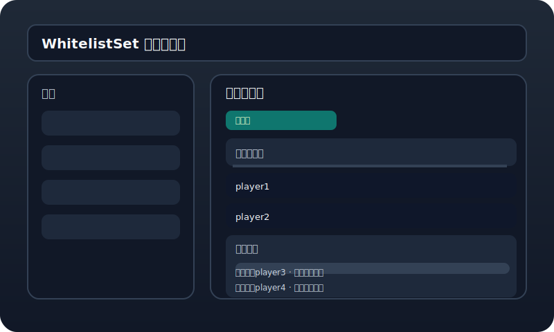

# WhitelistSet

白名单管理插件，基于 Bukkit/Spigot 提供 Web 管理控制台、白名单申请页面和邮件通知配置。

## 特性

- 自动开启服务器白名单
- 内置管理员 Web 控制台
- 可选的外部白名单申请页面
- 管理申请记录、批准/拒绝申请
- 支持邮件通知配置（SMTP）

## 快速开始

1. 将 `WhitelistSet-1.0-SNAPSHOT.jar` 放入服务器的 `plugins/` 目录。
2. 启动服务器后，会自动生成 `plugins/WhitelistSet/config.yml`。
3. 访问管理控制台：`http://<服务器地址>:8080`。
4. 默认管理员密码：`admin123`。

## 配置

默认配置项如下：

```yaml
admin-port: 8080
apply-port: 8081
password: admin123
whitelist-apply.enabled: false
email.host: smtp.qq.com
email.port: 587
email.username: ""
email.password: ""
email.use-ssl: true
```

如果要启用申请页面，请设置：

```yaml
whitelist-apply.enabled: true
```

## 构建

此项目使用 Gradle 和 Java 21。

```bash
export JAVA_HOME=/usr/local/sdkman/candidates/java/21.0.10-ms
export PATH="$JAVA_HOME/bin:$PATH"
gradle build
```

构建成功后，插件 Jar 位于 `build/libs/` 或 `build/` 目录。

## 目录结构

- `src/main/java/` - 插件源码
- `src/main/resources/plugin.yml` - Bukkit 插件描述
- `src/main/resources/config.yml` - 默认配置文件

## 插件说明

- `Whitelistset`：插件入口，启动管理控制台和申请服务。
- `ConfigManager`：加载和保存配置。
- `WebServer`：内置管理 Web 控制台，支持权限验证。
- `ApplyServer`：外部白名单申请页面。
- `ApplicationManager`：管理申请记录、批准与拒绝。

## 截图

### 管理控制台



### 白名单申请页面


## 许可证

请根据项目需要补充许可证信息。